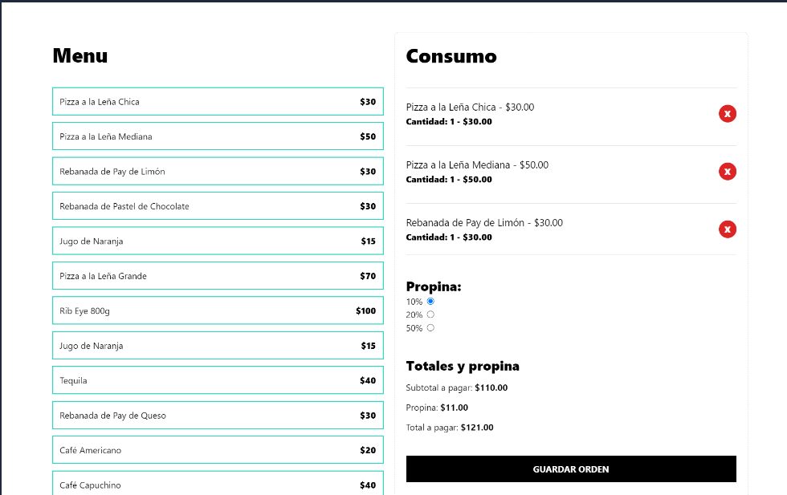

# Tip calculator

This Tip calculator were made using TypeScript, JS, Vite, and TailwindCSS

I learned a lot about creating my own hooks, UseMemo and management of a general State.
This project is from a course in Udemy.

Here is the link: 

[Tip calculator - Daniel Trinidad](https://symphonious-haupia-fbc18d.netlify.app/)